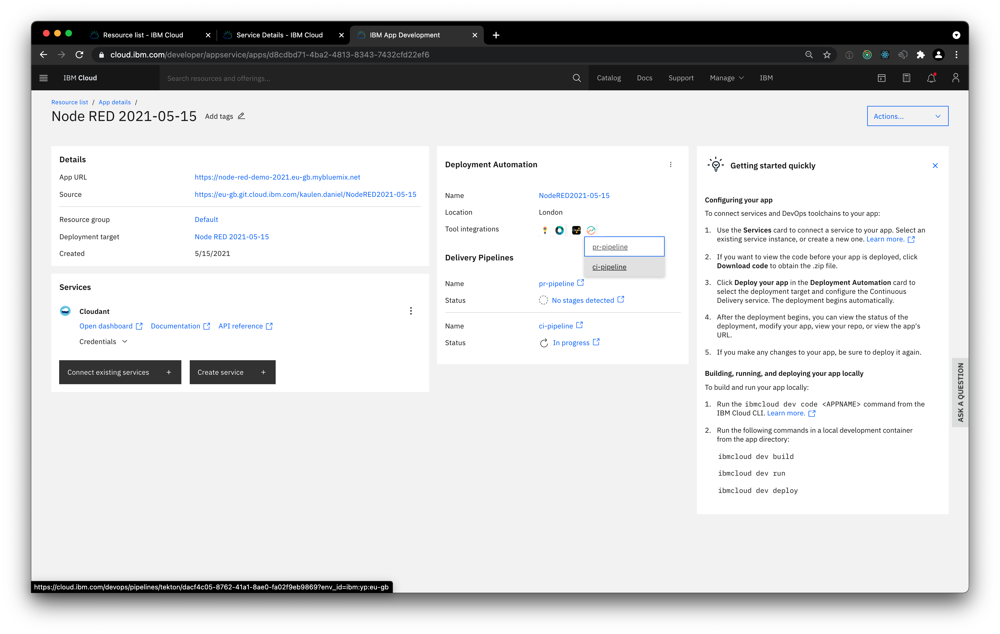
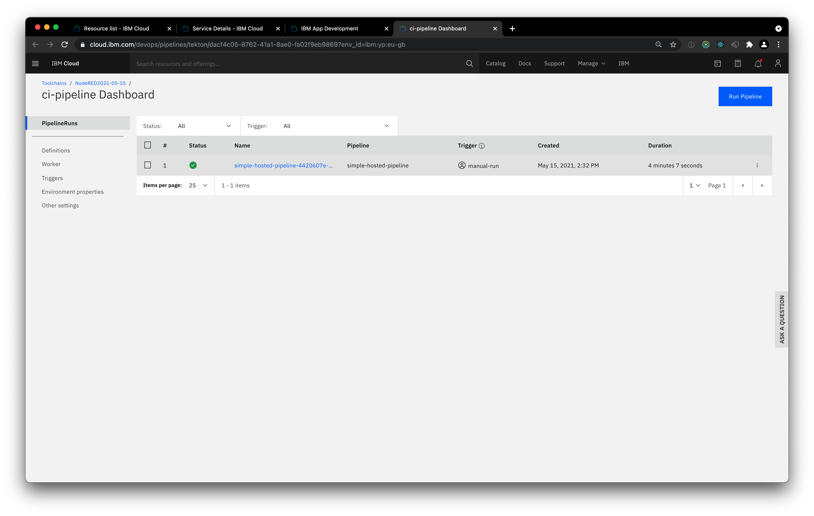
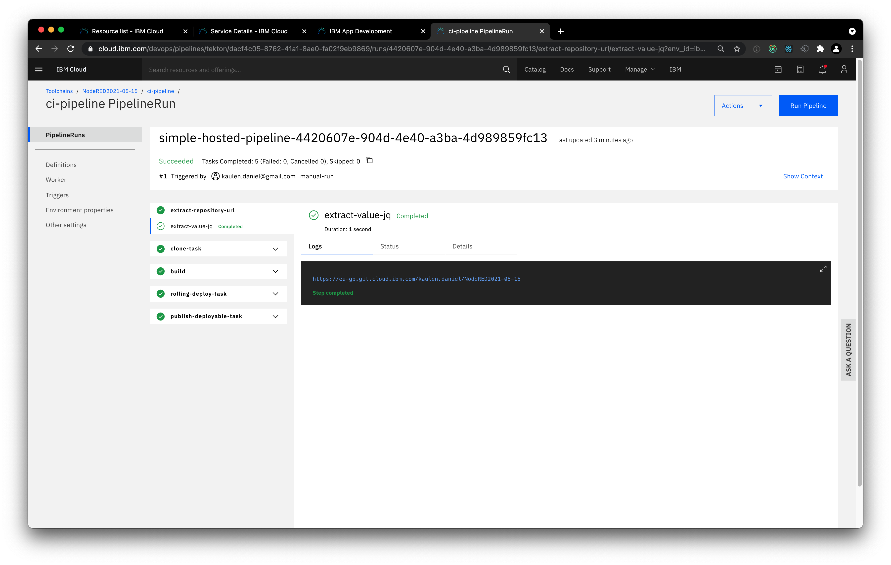

## How can I provision a free Node-RED instance on IBM Cloud?

- Access https://cloud.ibm.com/login to log in to IBM Cloud

- Search for _Node-RED_ and select _Node-RED App_ from the search results

- Switch to the _Create_ tab and enter details as shown below (choose a nearby region)

- Select _Deploy your app_

- Create an API key via the _New_ button and choose _Cloud Foundry_ as deployment target
    - Note: leave the memory allocation per instance at 256 MB to avoid that you exceed the free quota in your CloudFoundry account

- Choose a region with an existing Cloud Foundry Organization (here: London) or follow the instructions on the right to create one.
- Choose the host name to make your app available at and click _Next_

- Click _Create_

- Switch to the _Delivery Pipeline_

- Wait until both stages (Build & Deploy) succeeded

- Your app is now available at the host name you specified in a previous step

- Access your Node-RED instance (e.g. https://node-red-hhz-demo.eu-gb.cf.appdomain.cloud/)

- Configure your Node-RED instance

- Select _Go to your Node-RED flow editor_

- Log in

Happy prototyping. 

For other deployment options see also https://nodered.org/docs/getting-started/.
